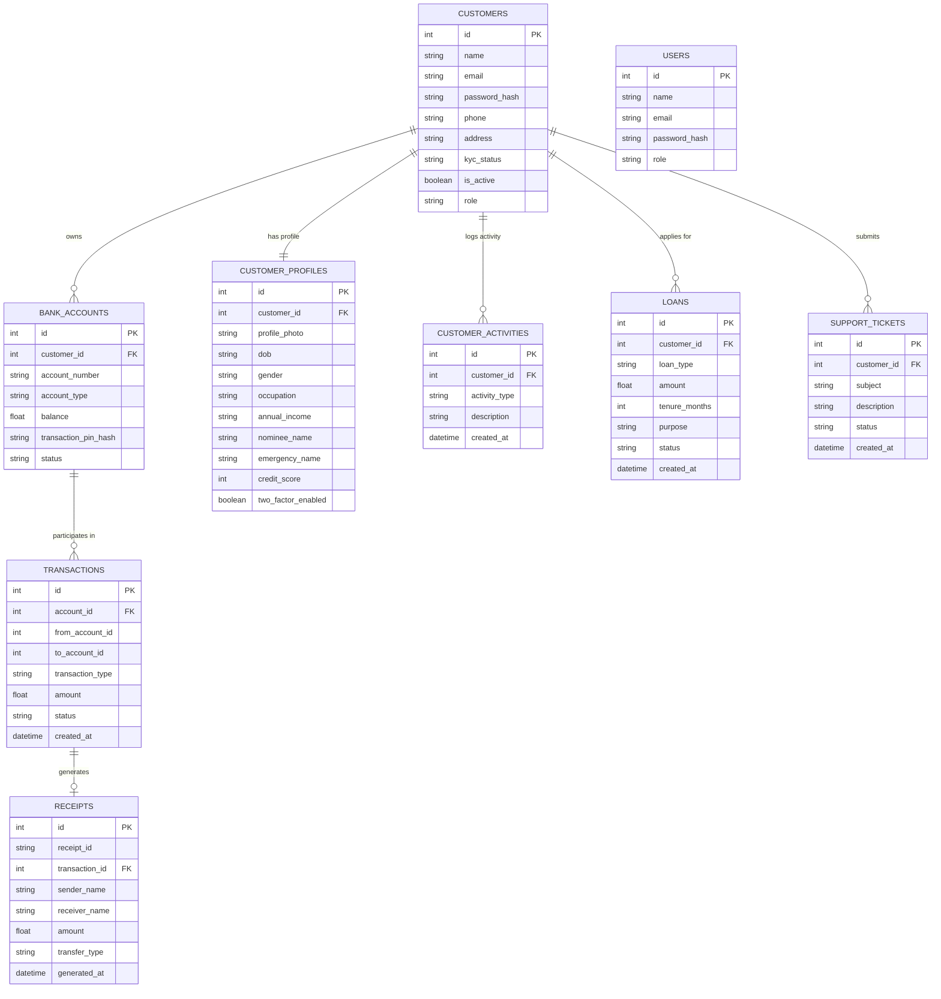

# Bank Management System

A comprehensive web application designed to manage banking operations for both Customers and Administrators. The project is split into a **Flask Python backend** and a **React + Vite frontend** powered by Bootstrap.

---

## 🚀 Features

### 👤 Customer Portal
*   **Registration & Security:** Account creation requiring Admin approval. Secure JWT-based authentication.
*   **Financial Dashboard:** Overview of total balances, deposits, withdrawals, loan status, and active support tickets. Includes an interactive monthly balance flow chart.
*   **Account Management:** Create and view Savings or Checking bank accounts.
*   **Transactions:** Perform secure transactions including:
    *   Deposits
    *   Withdrawals
    *   Peer-to-peer transfers (Transfer In / Transfer Out)
*   **Loans:** Submit loan applications and track their approval progress.
*   **Customer Support:** Create and track support tickets for inquiries.

### 🔑 Administrator Portal
*   **KYC & Customer Approval:** Review, approve, or reject customer registrations (KYC verification).
*   **Account Controls:** Create, freeze, activate, or close customer bank accounts.
*   **Audit Logs & Transactions:** Monitor and filter transaction history across the bank by date range and transaction type.
*   **Loan Processing:** Review loan applications (Approve with automatic balance credit or Reject with remarks).
*   **Admin Dashboard:** Visual insights of key metrics (active customers, loans, tickets) and transaction trends over the past 7 days.
*   **Support Desk:** Resolve customer support tickets.

---

## 🛠️ Technical Stack

### Backend
*   **Framework:** Flask (Python)
*   **Database:** SQLite (via SQLAlchemy)
*   **Authentication:** Flask-JWT-Extended
*   **CORS Support:** Flask-CORS

### Frontend
*   **Framework:** React 19 (Vite)
*   **Styling:** Bootstrap 5
*   **Charts:** Recharts / SVG-based rendering
*   **API Client:** Axios

---

## 📊 Entity-Relationship (ER) Diagram



---

## 📂 Directory Structure

```text
BankManagement/
├── backend/                  # Flask Backend
│   ├── database/             # Database configuration
│   ├── instance/             # Local database storage (bank.db)
│   ├── models/               # SQLAlchemy DB Models (User, Account, Transaction, Loan, Support)
│   ├── routes/               # Flask API Blueprints (Auth, Admin, Customer, etc.)
│   ├── utils/                # Database seeder and helpers
│   ├── app.py                # Backend entry point
│   ├── config.py             # Flask configuration settings
│   └── requirements.txt      # Python dependencies
│
├── frontend/                 # React Frontend (Vite)
│   ├── src/
│   │   ├── components/       # Reusable components
│   │   ├── layouts/          # Main page layouts
│   │   ├── pages/            # Page components (Dashboard, Login, Loans, Support, etc.)
│   │   ├── routes/           # Routing configurations
│   │   ├── services/         # Axios API Client config
│   │   ├── styles/           # Styling files
│   │   ├── App.jsx           # Main App component
│   │   └── main.jsx          # Entry point
│   ├── package.json          # Node dependencies and scripts
│   └── vite.config.js        # Vite configurations
```

---

## ⚙️ Getting Started

### Prerequisites
*   Python 3.8+
*   Node.js (v18+) & npm

### 1. Backend Setup & Run

1. Navigate to the `backend/` directory:
   ```bash
   cd backend
   ```
2. Create a virtual environment:
   ```bash
   python -m venv venv
   ```
3. Activate the virtual environment:
   *   **Windows (PowerShell):**
       ```powershell
       .\venv\Scripts\Activate.ps1
       ```
   *   **macOS/Linux:**
       ```bash
       source venv/bin/activate
       ```
4. Install dependencies:
   ```bash
   pip install -r requirements.txt
   ```
5. Run the backend server:
   ```bash
   python app.py
   ```
   *Note: On initial run, the application automatically creates `instance/bank.db` and seeds the default administrator account.*

### 2. Frontend Setup & Run

1. Open a new terminal window and navigate to the `frontend/` directory:
   ```bash
   cd frontend
   ```
2. Install npm packages:
   ```bash
   npm install
   ```
3. Start the Vite development server:
   ```bash
   npm run dev
   ```
4. Open your browser and navigate to the local address displayed (typically `http://localhost:5173`).

---

## 🔑 Testing Credentials

| Role | Email | Password |
| :--- | :--- | :--- |
| **Administrator** | `admin@bank.com` | `admin123` |
| **Customer** | *Register a new customer account in the UI* | *Your password* |

---

## 📌 API Endpoints Overview

| Base Endpoint | Method | Path | Description | Access |
| :--- | :--- | :--- | :--- | :--- |
| **/api/auth** | `POST` | `/register` | Register a new customer account | Public |
| | `POST` | `/login` | Authenticate customer/admin | Public |
| | `GET` | `/profile` | Retrieve current profile | Customer |
| **/api/customer** | `GET` | `/dashboard-summary` | Overview statistics & charts | Customer |
| | `GET` | `/profile` | Retrieve customer profile | Customer |
| **/api/accounts** | `GET` | `/` | Get bank accounts associated with user | Customer |
| **/api/transactions** | `POST` | `/deposit` | Deposit funds | Customer |
| | `POST` | `/withdraw` | Withdraw funds | Customer |
| | `POST` | `/transfer` | Transfer funds between accounts | Customer |
| **/api/loans** | `POST` | `/apply` | Apply for a bank loan | Customer |
| **/api/support** | `POST` | `/create-ticket` | Submit a support ticket | Customer |
| **/api/admin** | `GET` | `/customers` | List all registered customers | Admin |
| | `PUT` | `/approve-kyc/<id>` | Approve customer KYC | Admin |
| | `POST` | `/create-account` | Create account for customer | Admin |
| | `PUT` | `/freeze-account/<id>` | Freeze a bank account | Admin |
| | `PUT` | `/approve-loan/<id>` | Approve and credit loan | Admin |
| | `PUT` | `/reject-loan/<id>` | Reject a loan request | Admin |
| | `PUT` | `/resolve-ticket/<id>` | Close a support ticket | Admin |